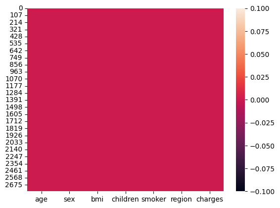

# Laporan Proyek Machine Learning
### Nama : Aditya Eka Purwanto
### Nim : 211351005
### Kelas : Malam B

## Domain Proyek

Asuransi kesehatan sangat penting karena memberikan akses ke perawatan medis yang terjangkau, melindungi individu dari beban keuangan yang besar, mendorong pencegahan dan pengobatan dini, serta meningkatkan kualitas hidup dan produktivitas.

## Business Understanding

Proyek estimasi harga asuransi kesehatan menjadi yang penting juga karena memberikan solusi untuk menentukan premi asuransi yang lebih adil, memungkinkan calon peserta asuransi membuat keputusan yang lebih baik, membantu perusahaan asuransi mengelola risiko, meningkatkan efisiensi operasional, dan memfasilitasi pengembangan produk asuransi yang inovatif.

Bagian laporan ini mencakup:

### Problem Statements

Menjelaskan pernyataan masalah latar belakang:
- Calon peserta yang tidak tau kisaran harga asuransi

### Goals

Menjelaskan tujuan dari pernyataan masalah:
- Diharapkan agar calon peserta asuransi memiliki estimasi berapa biaya yang harus mereka keluarkan untuk membayar asuransi tersebut dengan beberapa kriteria yang akan mereka input.


### Solution statements
- Mengajukan 2 atau lebih solution statement. Misalnya, menggunakan dua atau lebih algoritma untuk mencapai solusi yang diinginkan atau melakukan improvement pada baseline model dengan hyperparameter tuning.
- Solusi yang diberikan harus dapat terukur dengan metrik evaluasi.
- Membuat sebuah sistem yang dapat melakukan estimasi harga premi asuransi kesehatan yang dapat diakses oleh calon peserta asuransi berbasis web
- Model yang dibuat menggunakan metode estimasi dengan algoritma regresi linear 

## Data Understanding
dataset yang digunakan diambil dari Kaggle milik [MIRI CHOI](https://www.kaggle.com/mirichoi0218) dataset tersebut berisi sekumpulan data biaya yang dibayarkan untuk asuransi kesehatan yang berisi umur, jenis kelamin, BMI, jumlah anak, wilayah peserta, perokok atau bukan dan biaya yang dibayarkan

[Medical Cost Personal Datasets](https://www.kaggle.com/datasets/mirichoi0218/insurance/data)

### Variabel-variabel:
Age: usia penerima manfaat utama
Sex: jenis kelamin peserta asuransi, perempuan, laki-laki
BMI: Indeks massa tubuh, memberikan pemahaman tentang tubuh, berat badan yang relatif tinggi atau rendah terhadap tinggi badan,
indeks obyektif berat badan (kg/m^2) dengan menggunakan rasio tinggi dan berat badan, idealnya 18,5 sampai 24,9
Children: Jumlah anak yang ditanggung oleh asuransi kesehatan / Jumlah tanggungan
Smoker: Merokok
Region: wilayah tempat tinggal penerima manfaat di AS, timur laut, tenggara, barat daya, barat laut.
Charges: Biaya pengobatan perorangan yang ditagihkan oleh asuransi kesehatan

## Data Preparation
## Import Library
Library yang dibutuhkan dalam pembuatan model estimasi premi asuransi kesehatan yaitu:
```bash
import pandas as pd
import numpy as np
import matplotlib.pyplot as plt
import seaborn as sns
from sklearn.preprocessing import LabelEncoder
from sklearn.model_selection import train_test_split
from sklearn.linear_model import LinearRegression
```

## Import Dataset
Proses pembuatan model dilakukan di google collab, maka tahap yang harus dilakukan adalah:
1. upload file API kaggle
```bash
from google.colab import files
file.upload()
```
2. buat kolder penyimpanan file dataset
```bash
!mkdir -p ~/.kaggle
!cp kaggle.json ~/.kaggle/
!chmod 600 ~/.kaggle/kaggle.json
!ls ~/.kaggle
```
3. download dataset
```bash
!kaggle datasets download -d azadshahvaladov/apartment-prices-for-azerbaijan-market
```
4. unzip file yang sudah di download
```bash
!mkdir medical-insurance-price-prediction
!unzip medical-insurance-price-prediction.zip -d medical-insurance-price-prediction
!ls medical-insurance-price-prediction
```
5. panggil dataset yang sudah di download
```bash
df = pd.read_csv('/content/medical-insurance-price-prediction/Medical_insurance.csv')
```
## Data Cleaning

## Null values
setelah import dataset maka perlu dilakukan pengecekan null values menggunakan cara:
```bash
sns.heatmap(df.isnull())
```


## Duplicates
dilanjut pengecekan data yang duplikat:
```bash
# deteksi duplikasi data
df.duplicated().sum()
```
dikarekan terdapat data yang duplikat sebanyak 1435 maka perlu dilakukan cleaning data duplikat tersebut dengan cara:
```bash
df = df.drop_duplicates() #menghapus duplikasi data
df.duplicated().sum() #cek duplikat
```

Untuk melakukan sebuah proses menggunakan algoritma regresi linear maka tipe data yang dibutuhkan adalah integer. Terdapat 3 kolom dalam dataset yang memiliki tiper data object, maka dari itu perlu dilakukannya konversi tipe data menjadi integer menggunakan kode:
```bash
# Konversi Smoker
# Buat instance LabelEncoder
label_encoder = LabelEncoder()

# Terapkan LabelEncoder pada kolom 'smoker' dan simpan dalam kolom baru 'smoker2'
df['smoker2'] = label_encoder.fit_transform(df['smoker'])

# Konversi Gender
df['sex2'] = label_encoder.fit_transform(df['sex'])

# Konversi region
df['region2'] = label_encoder.fit_transform(df['region'])
```

Visualisasi data perokok berdasarkan jenis kelamin
```
sns.catplot(x="smoker", kind="count",hue = 'sex', palette="pink", data=df)
```


Distribusi premi asuransi berdasarkan perokok dan non perokok
```
f= plt.figure(figsize=(12,5))

ax=f.add_subplot(121)
sns.distplot(df[(df.smoker == "no")]["charges"],color='c',ax=ax)
ax.set_title('Distribution of charges for non-smokers')

ax=f.add_subplot(122)
sns.distplot(df[(df.smoker == "yes")]['charges'],color='b',ax=ax)
ax.set_title('Distribution of charges for smokers')
```


## Modeling
tahapan pertama dalam melakukan modelling yaitu:
1. seleksi fitur dan label:
```bash
features = ['age','sex2','bmi','children','smoker2','region2']
x = df[features]
y = df['charges']
x.shape, y.shape
```
3. membagi data testing dan training
```bash
x_train, X_test, y_train, y_test = train_test_split(x,y,random_state=70)
y_test.shape
```
5. lakukan proses modelling menggunakan regresi linear
```bash
lr = LinearRegression()
lr.fit(x_train,y_train)
pred = lr.predict(X_test)
```
7. cek akurasi model
```bash
score = lr.score(X_test, y_test)
print('akurasi model regresi linier = ', score*100,"%")
```
dari proses modelling tersebut didapatkan akurasi sebesar **75.53782234810413 %**

## Evaluation
setelah pembuatan model selesai dilanjutkan kepada uji model dengan melakukan testing dengan inputan yang sesuai dengan yang sudah di deklarasikan sebelumnya yaitu:
```bash
# 'age','sex2','bmi','children','smoker2','region2'
input_data = np.array([[19,0,27.9,0,1,3]])

prediction = lr.predict(input_data)
print('Estimasi Biaya Medis dalam US Dolar :', prediction)
```

## Deployment
[Hasil Deploy](https://estimasi-medical-adit.streamlit.app/).

